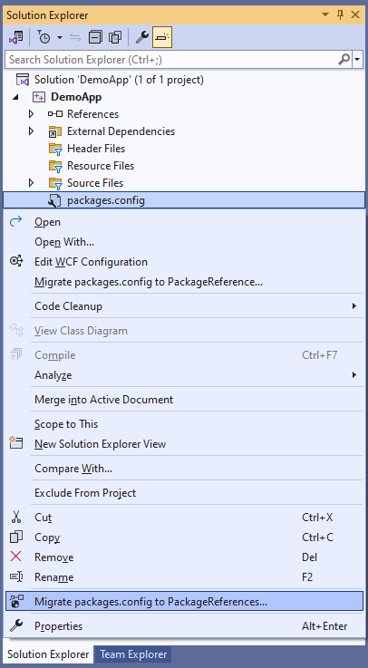

# Migrate packages.config to PackageReferences

This Visual Studio extension migrates packages.config to PackageReferences.

It works with C# csproj and native C++ vcxproj Visual Studio project files.

[Download it from the Visual Studio Marketplace](https://marketplace.visualstudio.com/items?itemName=RamiAbughazaleh.MigratePackagesConfigToPackageReferencesExtension)

## Getting started

1. Download and install the extension.  
2. Right-click on `packages.config` and select `Migrate packages.config to PackageReferences...`.  



3. Wait until the process finishes.  
  Check the status bar or the `Migrate packages.config to PackageReferences Extension` pane in the `Output Window` for details.


## Technical Details

This extension will first create a backup of the project and `packages.config` files.  
For example, `MyProject.vcxproj` and `packages.config` will be copied to `MyProject.vcxproj.bak` and `packages.config.bak` respectively.  

If the project and `packages.config` files are source controlled, they will be checked out for modification.  

The NuGet packages referenced in `packages.config` will be migrated to the project file in the new `PackageReference` format.  
For example, the following elements in the `vcxproj` project file:
```
  <Import Project="..\packages\MyPackage.1.0.0\build\MyPackage.props" Condition="Exists('..\packages\MyPackage.1.0.0\build\MyPackage.props')" />

  <ItemGroup>
    <None Include="packages.config" />
  </ItemGroup>

  <Target Name="EnsureNuGetPackageBuildImports" BeforeTargets="PrepareForBuild">
    <PropertyGroup>
      <ErrorText>This project references NuGet package(s) that are missing on this computer. Use NuGet Package Restore to download them.  For more information, see http://go.microsoft.com/fwlink/?LinkID=322105. The missing file is {0}.</ErrorText>
    </PropertyGroup>
    <Error Condition="!Exists('..\packages\MyPackage.1.0.0\build\MyPackage.props')" Text="$([System.String]::Format('$(ErrorText)', '..\packages\MyPackage.1.0.0\build\MyPackage.props'))" />
  </Target>
```

will be converted to this:
```
  <ItemGroup>
    <PackageReference Include="MyPackage" Version="1.0.0" />
  </ItemGroup>
```


After the project file has been updated, `packages.config` will be deleted, and the project reloaded.


## Troubleshooting

Check the `Migrate packages.config to PackageReferences Extension` pane in the `Output Window` for detailed logs.

## References

- [Visual Studio Developer Community Feedback: Use PackageReference in vcxproj](https://developercommunity.visualstudio.com/t/Use-PackageReference-in-vcxproj/351636)  
- [StackOverflow Question: PackageReference for NuGet packages in C++ projects](https://stackoverflow.com/q/50599104/90287)  
- [Github dotnet project-system issue: Make the PackageReference support general purpose for all languages](https://github.com/dotnet/project-system/issues/2491)  
- [Github Repo: Example C++ project that uses NuGet PackageReference (instead of packages.config)](https://github.com/japj/CppWithNuGetPackageReference)  
- [Microsoft C++ Dev Blog: Announcing NuGet PackageReference support for C++/CLI MSBuild projects targeting .NET Core and .NET 5 or higher](https://devblogs.microsoft.com/cppblog/announcing-nuget-packagereference-support-for-c-cli-msbuild-projects-targeting-net-core/)  
- [Microsoft Learn Docs: Migrate from packages.config to PackageReference](https://learn.microsoft.com/en-us/nuget/consume-packages/migrate-packages-config-to-package-reference)  

- [Software Meadows Blog Post: Revert PackageReference Project to Packages.config](https://www.softwaremeadows.com/posts/revert_packagereference_project_to_packages_config/)  
- [StackOverflow Question: Switch back to packages.config](https://stackoverflow.com/q/45962998/90287)
- [Visual Studio 2017 Extension: NuGet PackageReference Upgrader](https://github.com/CloudNimble/PackageReferenceUpgrader)

## Why was this extension created? Visual Studio 2017 Version 15.7 and later has this feature already.

The feature built-into Visual Studio 2017 Version 15.7 and later does not support native C++ projects.

The following error appears:


> Project is not eligible for migration. Either the project is not packages.config based or doesn't support PackageReference yet. Visit https://docs.microsoft.com/en-us/nuget/reference/migrate-packages-config-to-package-reference for more information.


## Rate and Review

Has this extension helped you at all?

If so, please rate and share it.

Thank you! :)
